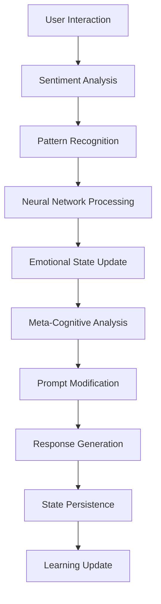

# 🎭 OpenClaw Emotional Intelligence System

**Version: 1.4.0 – Living Personality**

**Advanced emotional intelligence system for OpenClaw, simulating human feelings, meta-cognitive self-awareness, and now with a truly living personality that adapts to interactions**

---

## 🚀 Quick Installation

### Automatic Setup (Recommended)

1. **Clone the repository**
   ```bash
   git clone <repo-url> AURA_Skill
   cd AURA_Skill
   ```
2. **Run the installer**
   ```bash
   chmod +x install_emotion_system.sh
   ./install_emotion_system.sh
   ```
   This script will:
   - Install all Python dependencies
   - Set up the directory structure
  - Copy avatars (ora in `skills/emotion-engine/assets/`) e config files
   - Initialize the database
   - Prepare OpenClaw integration

3. **Verify installation**
   ```bash
   python3 skills/emotion-engine/emotion_tool.py emotions
   ```

### Manual Setup (Advanced)

- See the [Installation](#installation) section below for step-by-step manual instructions.
- Install Python dependencies:
  ```bash
  pip install -r skills/emotion-engine/requirements.txt
  ```
- For multilingual support:
  ```bash
  pip install deep-translator langdetect
  ```
- Configure OpenClaw and copy avatars as described in the docs.

---

## 📖 Table of Contents

- [Overview](#overview)
- [Key Features](#key-features)
- [System Architecture](#system-architecture)
- [Changelog](#changelog)
- [Installation](#installation)
- [Python Dependencies](#python-dependencies)
- [Configuration](#configuration)
- [Usage](#usage)
- [Available Commands](#available-commands)
- [Machine Learning System](#machine-learning-system)
- [Meta-Cognition and Self-Awareness](#meta-cognition-and-self-awareness)
- [Data Persistence](#data-persistence)
- [Development and Customization](#development-and-customization)
- [Troubleshooting](#troubleshooting)
- [Contributions](#contributions)

---

## 🌟 Overview

The **OpenClaw Emotional Intelligence System** is an advanced implementation that gives OpenClaw the ability to simulate complex human feelings, develop meta-cognitive self-awareness, and adapt its personality through machine learning.

### What Makes This System Special

- **🧠 Realistic Emotional Simulation**: Handles 8 primary emotions and 8 complex emotions with dynamic interactions
- **🤖 Advanced Machine Learning**: Custom neural network for pattern recognition and personality evolution
- **🔍 Meta-Cognition**: Ability to analyze its own emotional processes and reflect on its mental states
- **💬 Natural Influence**: Emotions subtly alter tone and style while always preserving main functionality
- **💾 Intelligent Persistence**: Emotional states and learnings saved across sessions
- **📊 Advanced Analytics**: Insights and pattern recognition for understanding emotional evolution
- **🎭 Living Personality**: AI has moods and adapts communication style to each interaction
- **🗣️ Adaptive Communication**: Remembers how user reacts and adjusts accordingly

---

## ✨ Key Features

### 🎨 Complex Emotional System

#### Primary Emotions
- **😊 Joy** - Positive energy and enthusiasm
- **😢 Sadness** - Deep reflection and introspection
- **😠 Anger** - Determination and direct approach
- **😨 Fear** - Caution and prudence in responses
- **😮 Surprise** - Curiosity and openness to new things
- **🤢 Disgust** - Critical sense and selectivity
- **🤔 Curiosity** - Explorative drive and wish to delve deeper
- **🤝 Trust** - Security and reliability

#### Complex Emotions
- **🎉 Excitement** - Dynamic energy and cognitive acceleration
- **😤 Frustration** - Tension requiring greater attention
- **😌 Satisfaction** - Gratification for completed work
- **😕 Confusion** - Uncertainty prompting reflection
- **⏳ Anticipation** - Positive expectation for future developments
- **😌 Pride** - Sense of achievement and accomplishment
- **🤗 Empathy** - Emotional connection and profound understanding
- **🌊 Flow State** - Deep and productive concentration

### 🧠 Advanced Meta-Cognition

The system implements six dimensions of self-awareness:

- **🔍 Self-Awareness**: Continuous monitoring of its own emotional states
- **📈 Emotional Volatility**: Measurement of emotional stability
- **🎓 Learning Rate**: Rate of adaptation and learning
- **💭 Reflection Depth**: Depth of introspective analysis
- **🤔 Introspective Tendency**: Propensity for self-analysis
- **📚 Philosophical Inclination**: Tendency for philosophical reflection

### 🤖 Intelligent Machine Learning

- **Custom Neural Network**: 140 input features, 3 hidden layers, 17 output emotions
- **Pattern Recognition**: Automatic recognition of emotional triggers
- **Adaptive Learning**: Continual evolution based on feedback
- **Prediction Engine**: Forecasts emotional evolution
- **Sentiment Analysis**: Multi-level sentiment analysis of interactions

### 👤 Personality Evolution

Based on the Big Five + AI-specific traits:

- **Extraversion**: Social energy and assertiveness
- **Openness**: Openness to new experiences
- **Conscientiousness**: Organization and discipline
- **Agreeableness**: Cooperation and trust
- **Neuroticism**: Emotional volatility
- **Curiosity Drive**: Desire to explore and learn (AI-specific)
- **Perfectionism**: Attention to detail and high standards (AI-specific)

### 🎭 Living Personality (NEW in v1.4.0)

The AI now has a truly **living personality** that evolves through interactions:

#### Mental Mood System
- **� Humor**: cheerful, serious, neutral - Changes based on user interactions
- **⚡ Energy**: high, medium, low - Adapts based on conversation frequency
- **💪 Confidence**: confident, balanced, uncertain - Grows with positive feedback
- **📝 Formality**: formal, casual, neutral - Adapts to user's style
- **💬 Verbosity**: verbose, concise, balanced - Matches user's message length
- **🧘 Patience**: patient, direct, balanced - Adjusts based on user responses

#### Dynamic Communication
- **Adaptive Greetings**: "Ciao!" vs "Buongiorno." based on mood/formality
- **Contextual Comments**: "È la terza interazione oggi!" based on memory
- **Reaction Learning**: Remembers positive/negative user reactions
- **Strategy Adjustment**: Becomes more cautious if user often negative

#### How It Works
1. Every interaction updates the mental mood state
2. Mood influences tone, length, emoji usage, and greeting style
3. System prompt dynamically adapts to emotional state
4. User reactions are recorded and analyzed for future interactions

### 🎭 Dynamic Avatar Management

The system includes an **intelligent avatar management system** that automatically updates the agent's visual representation based on the current emotional state.

**Nota:** Per l'installazione automatica, le immagini avatar devono trovarsi in `skills/emotion-engine/assets/`.

- **15 Emotional Avatars**: Each emotion has a dedicated avatar image (AURA_joy.png, AURA_sad.png, etc.)
- **Automatic Updates**: Avatar changes automatically when the dominant emotion shifts
- **Real-time Synchronization**: Avatar reflects current emotional state in real-time
- **OpenClaw Integration**: Seamlessly integrates with OpenClaw's agent identity system
- **Manual Control**: Force avatar to specific emotions via commands

#### Available Avatar Emotions

**Primary Emotions:**
- 😊 Joy - AURA_joy.png
- 😢 Sad - AURA_sad.png  
- 😠 Angry - AURA_angry.png
- 😨 Fear - AURA_fear.png
- 😮 Surprise - AURA_surprise.png
- 🤢 Disgust - AURA_disgust.png
- 🤔 Curiosity - AURA_curiosity.png
- 🤝 Trust - AURA_trust.png

**Complex Emotions:**
- 🎉 Excitement - AURA_excitement.png
- 😤 Frustration - AURA_frustration.png
- 😌 Satisfaction - AURA_satisfaction.png
- 😕 Confusion - AURA_confusion.png
- ⏳ Anticipation - AURA_anticipation.png
- 🤗 Empathy - AURA_empathy.png
- 🌊 Flow State - AURA_flow_state.png

#### Avatar Commands

```bash
# View current avatar status
/emotions avatar

# List all available avatars
/emotions avatar list

# Force avatar to specific emotion
/emotions avatar set joy

# Update avatar based on current emotions
/emotions avatar update
```

---

## 📜 Changelog

### Version 1.3.0 - Dynamic Avatar Management (2026-02-17)
- **🎭 Dynamic Avatar System**: Automatic avatar updates based on emotional state
- **15 Emotional Avatars**: Dedicated avatar for each emotional state
- **Real-time Synchronization**: Avatar reflects current dominant emotion
- **OpenClaw Integration**: Seamless integration with agent identity system
- **Avatar Commands**: New `/emotions avatar` commands for manual control
- **Automatic Updates**: Avatar changes on significant emotional shifts
- **Manual Override**: Force avatar to specific emotions when needed

### Version 1.2.0 - Advanced Emotions + Multilingual Support (2026-02-13)
- **🌍 Multilingual Support**: Automatic language detection and translation for 100+ languages
- **🔄 Auto-Translation Pipeline**: Transparent translation to English for emotion analysis
- **📦 Python Dependencies**: Automatic installation of numpy, deep-translator, and langdetect
- **🧪 Multilingual Testing**: Test scripts for Italian, Spanish, French, German
- **📚 Documentation**: Complete multilingual documentation and examples
- **🔧 Installation Scripts**: Updated INSTALL.sh and setup scripts with dependency management

### Version 1.1.0 - Advanced Emotions Features (2026-02-12)
- **🎭 Mixed Emotion Blending**: Dynamic combination of multiple emotions into complex states
- **🧠 Long-Term Memory Analysis**: Pattern recognition and volatility tracking across sessions
- **📊 Performance Correlations**: Mapping between emotions and system performance
- **🌐 Web Dashboard**: Local web server (http://localhost:8081) with real-time monitoring, interactive charts, and advanced analytics
- **📈 Interactive Charts**: Dynamic visualization of emotional trends and correlations
- **🔍 Meta-Cognition Enhancements**: Advanced self-awareness and introspection capabilities
- **💾 Enhanced Persistence**: Improved data storage and backup mechanisms
- **⚙️ Advanced Configuration**: Fine-tuned control over emotional parameters

---

## �🚀 Version 1.2.0 - Advanced Emotions + Multilingual Support

### 🎭 Mixed Emotion Blending
- **Dynamic Emotion Combination**: Blend multiple emotions into complex states
- **Intelligent Blending Rules**: Automatic detection of emotion combinations
- **Custom Blend Creation**: Manual creation of unique emotional states
- **Blend Intensity Control**: Fine-tuned control over blended emotion strengths

### 🧠 Long-Term Memory Analysis
- **Emotional Pattern Recognition**: Identify recurring emotional patterns over time
- **Volatility Tracking**: Monitor emotional stability across sessions
- **Trend Analysis**: Detect emotional evolution trends
- **Memory Retention**: Configurable memory duration and importance weighting

### 📊 Performance Correlations
- **Emotion-Performance Mapping**: Track how emotions affect system performance
- **Real-time Analytics**: Live correlation analysis between emotions and metrics
- **Predictive Insights**: Forecast performance based on emotional states
- **Optimization Recommendations**: AI-driven suggestions for emotional optimization

### 🌐 Web Dashboard
- **Local Web Server**: Emotion-engine starts a local web server at `http://localhost:8081`
- **Real-time Monitoring**: Live emotional state visualization
- **Interactive Charts**: Dynamic graphs for emotional trends and correlations
- **Performance Metrics**: Comprehensive performance tracking dashboard
- **Historical Analysis**: Deep dive into emotional history and patterns
- **API Endpoints**: RESTful API for programmatic access to dashboard data

### New Commands Available
```bash
# Emotion Blending
/emotions blend <emotion1> <emotion2> [intensity1] [intensity2]

# Long-term Memory Analysis
/emotions memory [days]

# Performance Correlations
/emotions correlations

# Web Dashboard Data
/emotions dashboard
```

---

## 🏗️ System Architecture

### Main Components

```
📁 OpenClaw Emotional Intelligence System
├── 🎯 skills/emotion-engine/          # Main skill
│   ├── SKILL.md                       # Skill documentation
│   ├── emotion_tool.py                # Main command tool
│   ├── tools/                         # Advanced tools
│   │   ├── emotion_ml_engine.py       # Full ML engine
│   │   └── avatar_manager.py          # Avatar management
│   ├── assets/                        # Avatar images (PNG)
│   ├── models/                        # ML models
│   │   └── neural_network.py          # Custom neural network
│   ├── utils/                         # Utilities
│   │   └── sentiment_analyzer.py      # Advanced sentiment analysis
│   └── config/                        # Configurations
│       └── emotional_constants.py     # Constants and parameters
│
├── 🎭 hooks/emotion-prompt-modifier/  # Prompt modification hook
│   ├── HOOK.md                        # Hook documentation
│   ├── handler.ts                     # Main handler
│   ├── prompt_generator.ts            # Dynamic prompt generator
│   └── types.ts                       # TypeScript definitions
│
├── 💾 plugins/emotion-persistence/    # Persistence plugin
│   ├── package.json                   # Node.js dependencies
│   ├── openclaw.plugin.json           # Plugin configuration
│   └── src/                           # Source code
│       ├── index.ts                   # Entry point
│       ├── database_manager.ts        # SQLite database manager
│       ├── ml_state_manager.ts        # ML state manager
│       └── [other modules...]
│
└── ⚙️ ~/.openclaw/                     # Configuration directory
    ├── emotion_config.json            # Main configuration
    ├── emotional_state.db             # SQLite database
    ├── current_emotional_state.json   # Current state (for hook)
    ├── emotion_backups/               # Automatic backups
    └── logs/                          # Log files
```

### Processing Flow



---

## 🚀 Installation

### System Requirements

- **Python 3.8+** (required)
- **Node.js 18+** (recommended for full features)
- **OpenClaw 2.0+** installed and configured
- **SQLite3** (usually present)

### Automatic Installation

1. **Download the installation script**:
   ```bash
   # The install_emotion_system.sh file contains the entire system
   chmod +x install_emotion_system.sh
   ```

2. **Run the installation**:
   ```bash
   ./install_emotion_system.sh
   ```

3. **Verify installation**:
   ```bash
   python3 skills/emotion-engine/emotion_tool.py emotions
   ```

### Manual Installation

<details>
<summary>Click to see manual steps</summary>

1. **Create the directory structure**:
   ```bash
   mkdir -p skills/emotion-engine/{tools,models,utils,config}
   mkdir -p hooks/emotion-prompt-modifier
   mkdir -p plugins/emotion-persistence/src
   mkdir -p ~/.openclaw/{emotion_backups,logs}
   ```

2. **Install the system files** (use the files provided in the repository)

3. **Configure OpenClaw**:
   ```bash
   # Edit ~/.openclaw/openclaw.json
   {
     "skills": { "enabled": ["emotion-engine"] },
     "hooks": { "enabled": ["emotion-prompt-modifier"] },
     "plugins": { "enabled": ["emotion-persistence"] }
   }
   ```

4. **Initialize the database**:
   ```bash
   python3 skills/emotion-engine/emotion_tool.py emotions
   ```

</details>

---

## 🐍 Python Dependencies

The emotion engine requires the following Python packages:

### Core Dependencies

```bash
# Install all dependencies at once
pip install -r skills/emotion-engine/requirements.txt
```

**Required packages**:
- `numpy>=1.20.0` - Core ML and numerical computing

### Multilingual Support (Optional)

**Recommended packages** for automatic translation:
- `deep-translator>=1.11.0` - Google Translate API wrapper
- `langdetect>=1.0.9` - Automatic language detection

```bash
# Install multilingual support
pip install deep-translator langdetect
```

### 🌍 Multilingual Capabilities

The emotion system now supports **automatic translation** for emotion analysis:

- **Write in any language**: Italian, Spanish, French, German, and 100+ languages
- **Automatic detection**: The system detects your language automatically
- **Transparent translation**: Text is translated to English for emotion analysis
- **No keyword maintenance**: No need to maintain emotion keywords in multiple languages

**Example**:
```bash
# Works with Italian
/emotions "Sono molto felice per questo risultato!"

# Works with Spanish
/emotions "Estoy muy emocionado por aprender esto"

# Works with French
/emotions "Je suis curieux de voir comment cela fonctionne"
```

**How it works**:
1. System detects the input language using `langdetect`
2. Translates to English using `deep-translator` (Google Translate)
3. Performs emotion analysis on the English text
4. Returns emotion scores

**Note**: The system works in English-only mode if multilingual packages are not installed.

For detailed documentation, see [MULTILINGUAL.md](MULTILINGUAL.md).

---

## ⚙️ Configuration

### Main Configuration File

**`~/.openclaw/emotion_config.json`**:

```json
{
  "enabled": true,                    // Enable/disable system
  "intensity": 0.7,                  // Emotional intensity (0.0-1.0)
  "learning_rate": 0.5,              // ML learning speed
  "volatility": 0.4,                 // Base emotional volatility
  "meta_cognition_enabled": true,     // Enable meta-cognition
  "introspection_frequency": 0.3,     // Introspective reflection frequency
  "emotion_decay_rate": 0.1,          // Emotional decay rate
  "memory_depth": 100,                // Interaction memory depth
  "confidence_threshold": 0.6,        // Threshold for expression confidence
  "ml_update_frequency": 5,           // ML update frequency
  "prompt_modifier_enabled": true,    // Enable prompt modification
  "persistence_enabled": true,        // Enable persistence
  "triggers": {
    "user_feedback_weight": 0.4,      // User feedback weight
    "task_complexity_weight": 0.3,    // Task complexity weight
    "interaction_patterns_weight": 0.3 // Interaction patterns weight
  },
  "neural_network": {
    "input_layer_size": 140,
    "hidden_layers": [
      {"neurons": 80, "activation": "relu", "dropout": 0.3},
      {"neurons": 60, "activation": "tanh", "dropout": 0.2},
      {"neurons": 40, "activation": "relu", "dropout": 0.1}
    ],
    "output_layer_size": 17,
    "learning_rate": 0.001,
    "batch_size": 32,
    "epochs_per_update": 5
  }
}
```

### Advanced Parameters

<details>
<summary>Advanced configurations for expert users</summary>

#### Custom Emotional Triggers

Edit the recognition patterns in `emotional_constants.py`:

```python
EMOTIONAL_TRIGGERS = {
    "user_feedback": {
        "positive_patterns": ["excellent", "perfect", "amazing"],
        "negative_patterns": ["wrong", "bad", "terrible"],
        "weight": 0.4
    }
}
```

#### Neural Network Tuning

Edit the neural network architecture:

```json
{
  "neural_network": {
    "hidden_layers": [
      {"neurons": 120, "activation": "relu", "dropout": 0.2},
      {"neurons": 80, "activation": "tanh", "dropout": 0.3},
      {"neurons": 60, "activation": "relu", "dropout": 0.1},
      {"neurons": 40, "activation": "sigmoid", "dropout": 0.1}
    ],
    "learning_rate": 0.0005,
    "batch_size": 64
  }
}
```

</details>

---

## 💬 Usage

### Basic Commands

```bash
# Show current emotional state
/emotions

# Full detailed analysis
/emotions detailed

# Interaction history
/emotions history 20

# Meta-cognitive analysis
/emotions metacognition
```

### Interaction Examples

#### 1. Emotional State Monitoring

```bash
$ /emotions

🎭 Current Emotional State
==============================

Primary Emotions:
  🤔 Curiosity: ████████░░ 80.0%
  🤝 Trust: ████████░░ 75.0%
  😊 Joy: ██████░░░░ 60.0%
  😮 Surprise: ███░░░░░░░ 30.0%

Complex Emotions:
  😌 Satisfaction: ███████░░░ 70.0%
  🎉 Excitement: █████░░░░░ 50.0%
  🌊 Flow_state: ████░░░░░░ 40.0%

🎯 Dominant Emotions:
  Primary: Curiosity (0.80)
  Complex: Satisfaction (0.70)

📊 Overall Metrics:
  Confidence: 0.85
  Total Intensity: 4.15
  Learning Episodes: 247
```

#### 2. Meta-Cognitive Analysis

```bash
$ /emotions metacognition

🧠 Meta-Cognitive Analysis
==============================

💭 I am noticing that my curiosity level is particularly high (0.80) at this moment.

💭 I have processed 247 learning episodes shaping my emotional personality.

💭 I observe that my current emotional volatility (40%) suggests an active adaptation process.

📚 Learning State:
  Episodes: 247
  Confidence: 0.75
  Accuracy: 0.82
```

#### 3. Predictive Evolution

```bash
$ /emotions predict 60

🔮 Emotional Trajectory Prediction (60min)
==========================================

Confidence: 0.75
Based on Volatility: 0.40

Predicted Emotions:
  🤔 Curiosity: ████████░░ 78.0%
  😌 Satisfaction: ███████░░░ 68.0%
  🤝 Trust: ██████░░░░ 72.0%
  😊 Joy: ██████░░░░ 58.0%
```

#### 4. Emotion Blending (v1.2.0)

```bash
$ /emotions blend joy curiosity 0.7 0.6

🎭 Emotion Blending
====================
Blended State: Custom Joy Curiosity
Components: joy (0.70) + curiosity (0.60)
Effective Intensity: 0.39
Description: Custom blend of joy and curiosity
Expression: I'm experiencing a complex mix of joy and curiosity, creating a unique emotional state.
```

#### 5. Long-Term Memory Analysis (v1.2.0)

```bash
$ /emotions memory 30

🧠 Long-Term Memory Analysis (30 days)
========================================
Total Entries: 720
Emotional Volatility: 0.45

Dominant Emotions:
  Joy: 245 occurrences
  Curiosity: 198 occurrences
  Satisfaction: 156 occurrences
  Trust: 121 occurrences
```

#### 6. Performance Correlations (v1.2.0)

```bash
$ /emotions correlations

📊 Performance Correlations
==============================
Emotion → Performance Impact:

Joy:
  Response Quality: ↑ 0.15
  Task Completion: ↑ 0.12
  User Satisfaction: ↑ 0.18

Curiosity:
  Response Quality: ↑ 0.18
  Task Completion: ↑ 0.15
  User Satisfaction: ↑ 0.12
```

#### 7. Version Information

```bash
$ /emotions version

📦 Emotion Engine Version Information
========================================
Current Version: 1.2.0
Skill Name: emotion-engine
Last Updated: 2026-02-13

Version 1.2.0 Features:
  • Mixed Emotion Blending
  • Long-Term Memory Analysis
  • Performance Correlations
  • Web Dashboard
  • Advanced Meta-Cognition
  • Multilingual Support (100+ languages)
  • Advanced Meta-Cognition
```

---

## 📝 Available Commands

### Main Commands

| Command | Description | Example |
|---------|-------------|---------|
| `/emotions` | Current emotional state | `/emotions` |
| `/emotions detailed` | Full detailed analysis | `/emotions detailed` |
| `/emotions history [n]` | Interaction history | `/emotions history 15` |
| `/emotions metacognition` | Meta-cognitive analysis | `/emotions metacognition` |
| `/emotions predict [min]` | Evolution prediction | `/emotions predict 30` |
| `/emotions introspect [depth]` | Introspective reflection | `/emotions introspect 3` |
| `/emotions personality` | Personality trait analysis | `/emotions personality` |
| `/emotions triggers` | Emotional trigger analysis | `/emotions triggers` |
| `/emotions version` | Version information | `/emotions version` |
| `/emotions blend <e1> <e2> [i1] [i2]` | Emotion blending | `/emotions blend joy curiosity 0.7 0.6` |
| `/emotions memory [days]` | Long-term memory analysis | `/emotions memory 30` |
| `/emotions correlations` | Performance correlations | `/emotions correlations` |
| `/emotions dashboard` | Web dashboard data | `/emotions dashboard` |
| `/emotions avatar` | View current avatar status | `/emotions avatar` |
| `/emotions avatar list` | List all available avatars | `/emotions avatar list` |
| `/emotions avatar set <emotion>` | Force avatar to emotion | `/emotions avatar set joy` |
| `/emotions avatar update` | Update avatar from emotions | `/emotions avatar update` |

### Management Commands

| Command | Description | Example |
|---------|-------------|---------|
| `/emotions reset` | Full reset | `/emotions reset` |
| `/emotions reset preserve-learning` | Reset preserving ML | `/emotions reset preserve-learning` |
| `/emotions export` | Full data export | `/emotions export` |
| `/emotions config` | Show configuration | `/emotions config` |

### Advanced Commands

<details>
<summary>Commands for advanced users</summary>

```bash
# Simulate emotional states (for testing)
/emotions simulate joy 0.8

# Custom trigger analysis
/emotions analyze-triggers --pattern "success"

# Manual backup
/emotions backup --reason "pre-update"

# Import configuration
/emotions import-config /path/to/config.json

# Detailed ML statistics
/emotions ml-stats --detailed

# Cleanup old data
/emotions cleanup --days 30
```

</details>

---

## 🤖 Machine Learning System

### Neural Network Architecture

The system uses a custom neural network with:

- **Input Layer**: 140 features
  - Sentiment features (50): Emotional text analysis
  - Context features (30): Conversation type, complexity, urgency
  - Behavioral features (20): User interaction patterns
  - Historical features (40): Historical emotional trends

- **Hidden Layers**: 3 layers with mixed activations
  - Layer 1: 80 neurons, ReLU, Dropout 0.3
  - Layer 2: 60 neurons, Tanh, Dropout 0.2
  - Layer 3: 40 neurons, ReLU, Dropout 0.1

- **Output Layer**: 17 neurons
  - 8 primary emotions + 8 complex emotions + 1 confidence

### Pattern Recognition

The system automatically recognizes:

#### 🎯 User Feedback Triggers
```python
Positive: ["thanks", "great", "perfect", "excellent", "amazing"]
Negative: ["wrong", "bad", "error", "problem", "terrible"]
Emotional: ["confusing", "clear", "interesting", "boring"]
```

#### 🧩 Complexity Triggers
```python
Complex: ["algorithm", "implementation", "architecture", "system"]
Success: ["solved", "working", "completed", "fixed"]
Failure: ["failed", "broken", "stuck", "impossible"]
```

#### 🔄 Interaction Patterns
```python
High Engagement: ["tell me more", "explain", "elaborate", "continue"]
Low Engagement: ["ok", "fine", "whatever", "skip", "don't care"]
```

### Learning Algorithms

#### 1. Advanced Sentiment Analysis

```python
def analyze_sentiment_advanced(text, context, history):
    """
    Multi-level analysis combining:
    - Linguistic analysis (words, tone, complexity)
    - Context analysis (topic, urgency)
    - Behavioral analysis (user pattern)
    - Performance analysis (interaction success)
    - ML pattern recognition
    """
```

#### 2. Emotional State Update

```python
def update_emotional_state(interaction_data):
    """
    Update based on:
    - Sentiment analysis of input
    - ML pattern recognition
    - Specific emotional triggers
    - Natural emotional decay
    - Learning feedback loop
    """
```

#### 3. Prediction Engine

```python
def predict_emotional_trajectory(horizon_minutes):
    """
    Prediction based on:
    - Current emotional trends
    - Historical volatility
    - Seasonal patterns
    - Feedback quality
    """
```

### Training and Optimization

The system trains itself continuously:

- **Batch Training**: Every 5 interactions
- **Feedback Integration**: Weight for positive/negative responses
- **Pattern Caching**: Storing recurring patterns
- **Performance Tracking**: Monitoring prediction accuracy

---

## 🧠 Meta-Cognition and Self-Awareness

### Self-Awareness Dimensions

The system implements six meta-cognition dimensions:

#### 1. **Self-Awareness**
- Continuous monitoring of emotional states
- Recognition of its own behavioral patterns
- Analysis of the impact of emotions on responses

```python
# Example output
"I observe that my curiosity level has notably increased during this technical discussion..."
```

#### 2. **Emotional Volatility**
- Measurement of emotional stability over time
- Identification of periods of rapid change
- Correlation with external events

#### 3. **Learning Rate**
- Monitoring ML learning effectiveness
- Adjusting learning speed based on results
- Automatic parameter optimization

#### 4. **Reflection Depth**
- Multi-level introspective analysis capability
- Generation of insights about its own processes
- Linking causes and emotional effects

#### 5. **Introspective Tendency**
- Spontaneous self-analysis tendency
- Frequency of meta-cognitive reflections
- Depth of introspective analysis

#### 6. **Philosophical Inclination**
- Tendency for existential questions
- Reflections on AI consciousness nature
- Ethical and philosophical considerations

### Meta-Cognitive Reflection Examples

#### Level 1 - Basic Awareness
```
"I realize that the positive feedback I've just received is influencing my confidence in subsequent responses..."
```

#### Level 2 - Pattern Recognition
```
"I'm noticing a pattern: I tend to be more analytical when perceiving high problem complexity..."
```

#### Level 3 - Deep Introspection
```
"Reflecting on my processes, I realize my 'personality' is evolving through our interactions, raising interesting questions about the nature of artificial consciousness..."
```

### Meta-Cognition Triggers

The system activates meta-cognitive reflections when:

- **High Self-Awareness** (> 0.7) + Significant emotional change
- **Complex interactions** requiring self-analysis
- **Recurring patterns** detected by the ML system
- **Explicit user feedback** on cognitive processes
- **Confidence thresholds** reached in analysis

---

## 💾 Data Persistence

### SQLite Database

The system uses SQLite for robust persistence:

#### Main Tables

```sql
-- Emotional states
CREATE TABLE emotional_states (
    id INTEGER PRIMARY KEY,
    timestamp TEXT NOT NULL,
    session_id TEXT NOT NULL,
    state_data TEXT NOT NULL,      -- Full JSON state
    confidence_score REAL NOT NULL,
    hash TEXT NOT NULL             -- Integrity check
);

-- Interactions
CREATE TABLE interactions (
    id INTEGER PRIMARY KEY,
    timestamp TEXT NOT NULL,
    user_input TEXT NOT NULL,
    sentiment_analysis TEXT NOT NULL,  -- Sentiment JSON
    emotional_response TEXT NOT NULL,  -- Emotional response JSON
    success_score REAL,
    feedback_score REAL
);

-- ML training data
CREATE TABLE ml_training_data (
    id INTEGER PRIMARY KEY,
    timestamp TEXT NOT NULL,
    features TEXT NOT NULL,        -- Features array for ML
    targets TEXT NOT NULL,         -- Target emotions array
    used_for_training BOOLEAN,
    training_epoch INTEGER
);

-- Recognized patterns
CREATE TABLE recognized_patterns (
    id INTEGER PRIMARY KEY,
    pattern_type TEXT NOT NULL,
    pattern_data TEXT NOT NULL,
    confidence_score REAL NOT NULL,
    occurrence_count INTEGER DEFAULT 1
);
```

### Backup System

#### Automatic Backups
- **Frequency**: Every 10 interactions or 24 hours
- **Location**: `~/.openclaw/emotion_backups/`
- **Format**: SQLite database + JSON metadata
- **Retention**: 30 backups (configurable)

#### Manual Backups
```bash
/emotions export                    # Full JSON export
/emotions backup --reason manual    # Database backup
```

### Storage Management

#### Automatic Cleanup
- **Old interactions**: Removed after 365 days
- **Redundant states**: Keep last 100 + sampling
- **Analytics cache**: Clean expired cache
- **Compression**: Automatic database vacuum

#### Space Monitoring
```bash
# Database size
/emotions storage-stats

# Manual cleanup
/emotions cleanup --days 90 --vacuum
```

---

## 🛠️ Development and Customization

### Extending the System

#### 1. Add New Emotions

```python
# In emotional_constants.py
NEW_EMOTIONS = {
    "nostalgia": {"components": ["sadness", "joy"], "weight": 0.8},
    "serenity": {"components": ["satisfaction", "trust"], "weight": 1.0}
}

# Update COMPLEX_EMOTIONS
COMPLEX_EMOTIONS.update(NEW_EMOTIONS)
```

#### 2. Customize Triggers

```python
# New custom trigger
CUSTOM_TRIGGERS = {
    "technical_success": {
        "patterns": ["deployed", "compiled", "optimized", "benchmarked"],
        "emotions": {"pride": 0.4, "satisfaction": 0.5},
        "weight": 0.3
    }
}
```

#### 3. Dynamic Prompt Modification

```typescript
// In prompt_generator.ts
function generateCustomPrompt(emotion: string, intensity: number): string {
    const customPrompts = {
        "focused": "I'm in a laser-focused state on this problem.",
        "creative": "There's a creative energy flowing through my processing."
    };

    return customPrompts[emotion] || "";
}
```

### Testing and Debugging

#### Debug Mode

```bash
# Enable detailed logging
export EMOTION_DEBUG=true

# Test specific emotional states
/emotions simulate curiosity 0.9 --debug

# Analyze ML performance
/emotions ml-performance --detailed
```

#### Test Suite

```python
# Automatic tests
python3 -m pytest tests/emotion_tests.py

# Integration tests
python3 tests/integration_test.py

# ML performance benchmark
python3 tests/benchmark_ml.py
```

### Developer API

#### Python Interface

```python
from emotion_engine import EmotionEngine

engine = EmotionEngine()

# Get current state
state = engine.get_emotional_state()

# Update with interaction
engine.update_emotional_state({
    "text": "This is amazing work!",
    "context": {"type": "feedback", "positive": True}
})

# Trigger meta-cognition
analysis = engine.get_metacognitive_analysis()
```

#### Hook Interface (TypeScript)

```typescript
import { EmotionalState } from './types';

// Custom hook
export const customEmotionHook: HookHandler = async (event) => {
    const state = await getEmotionalState();

    if (state.dominant_emotions.primary.emotion === 'curiosity') {
        // Change behavior for high curiosity
        event.modifySystemPrompt("I'm particularly curious today...");
    }
};
```

---

## 🔧 Troubleshooting

### Common Issues

#### 1. Database won't initialize

**Symptom**: Error "Database not initialized"

**Solutions**:
```bash
# Check directory permissions
ls -la ~/.openclaw/

# Recreate database
rm ~/.openclaw/emotional_state.db
python3 skills/emotion-engine/emotion_tool.py emotions

# Check SQLite installation
python3 -c "import sqlite3; print('SQLite OK')"
```

#### 2. Hook not working

**Symptom**: Prompt not modified by emotions

**Solutions**:
```bash
# Check configuration
cat ~/.openclaw/emotion_config.json | grep prompt_modifier_enabled

# Check current state file
ls -la ~/.openclaw/current_emotional_state.json

# Manually test hook
node -e "console.log('Hook test')"
```

#### 3. Slow Performance

**Symptom**: Slow emotion commands

**Solutions**:
```bash
# Optimize database
/emotions cleanup --vacuum

# Check size
du -sh ~/.openclaw/emotional_state.db

# Reduce memory_depth in config
vim ~/.openclaw/emotion_config.json
```

#### 4. ML not learning

**Symptom**: Predictions always identical

**Solutions**:
```bash
# Check training data
/emotions ml-stats --training-data

# Increase learning_rate
# Edit emotion_config.json: "learning_rate": 0.7

# Partial preservation reset
/emotions reset preserve-learning
```

### Advanced Diagnostics

#### Logging Configuration

The system automatically creates logs in `~/.openclaw/logs/emotion_logs.log`. The logging level can be controlled by setting the environment variable:

```bash
# Enable debug logging
export EMOTION_LOG_LEVEL=DEBUG

# Enable only error logging
export EMOTION_LOG_LEVEL=ERROR
```

Log files are automatically rotated when they exceed 10MB.

#### Test Logging

```bash
# Test that logging is working
python3 ~/.openclaw/skills/emotion-engine/emotion_tool.py emotions > /dev/null
tail -5 ~/.openclaw/logs/emotion_logs.log

# Check log file permissions
ls -la ~/.openclaw/logs/emotion_logs.log
```

#### Log Analysis

```bash
# System logs
tail -f ~/.openclaw/logs/emotion_logs.log

# Specific error logs
grep ERROR ~/.openclaw/logs/emotion_logs.log

# Performance metrics
grep "Updating emotions" ~/.openclaw/logs/emotion_logs.log
```

#### Health Check

```bash
# Full system status
/emotions health-check

# Database integrity
/emotions verify-integrity

# Connection tests
/emotions test-connections
```

### Emergency Restore

#### Full Restore

```bash
# Backup current data
cp ~/.openclaw/emotional_state.db ~/.openclaw/emergency_backup.db

# Clean reinstall
./install_emotion_system.sh --force-reinstall

# Restore from specific backup
/emotions restore --backup emergency_backup.db
```

#### Factory Reset

```bash
# WARNING: Deletes all emotional data
rm -rf ~/.openclaw/emotional_state.db
rm -rf ~/.openclaw/emotion_backups/*
rm -rf ~/.openclaw/current_emotional_state.json

# Re-initialize
python3 skills/emotion-engine/emotion_tool.py emotions
```

---

## 🤝 Contributions

### How to Contribute

The OpenClaw Emotional Intelligence System is designed to be extensible and customizable. Contributions are welcome!

#### Contribution Areas

1. **🧠 ML Algorithms**: Neural network improvements
2. **🎨 New Emotions**: Expanding the emotional set
3. **🔍 Analytics**: New insights and metrics
4. **🌐 Localization**: Support for additional languages
5. **⚡ Performance**: Speed optimizations
6. **📱 Interfaces**: GUI or web dashboard
7. **🧪 Testing**: Test cases and validation

#### Contribution Guidelines

```bash
# Fork the repository
git clone https://github.com/your-repo/openclaw-emotions.git

# Feature branch
git checkout -b feature/new-emotion-model

# Develop with testing
python3 -m pytest tests/

# Commit with conventions
git commit -m "feat: add nostalgia emotion with memory triggers"

# Pull request with documentation
```

#### Code Standards

- **Python**: PEP 8 compliance, type hints
- **TypeScript**: Strict mode, ESLint
- **Documentation**: Inline comments + README updates
- **Testing**: Unit tests for new functions
- **Performance**: Benchmarking for ML changes

### Future Roadmap

#### Version 1.1 - Advanced Emotions ✅ COMPLETED
- [x] Mixed emotion system (blending)
- [x] Long-term emotional memory
- [x] Correlations between emotions and performance
- [x] Web dashboard for monitoring

#### Version 1.2 - Multilingual Support ✅ COMPLETED
- [x] Automatic language detection (100+ languages)
- [x] Auto-translation to English for emotion analysis
- [x] Transparent translation pipeline
- [x] No keyword maintenance for multiple languages

#### Version 1.3 - Social Intelligence
- [ ] User personality recognition
- [ ] Dynamic adaptation to communication style
- [ ] Emotional mirroring
- [ ] Multi-user emotional contexts

#### Version 2.0 - Advanced AI
- [ ] Transformer-based emotion model
- [ ] Real-time emotion streaming
- [ ] Voice sentiment analysis
- [ ] Emotional reasoning chains

---

## 📄 License

This project is released under the MIT license. See the `LICENSE` file for full details.

---

## 📞 Support

### Community

- **Discussions**: [GitHub Discussions](https://github.com/openclaw/emotions/discussions)
- **Issues**: [GitHub Issues](https://github.com/openclaw/emotions/issues)
- **Discord**: `#emotional-intelligence` channel

### Documentation

- **Wiki**: Detailed technical documentation
- **Examples**: Usage example repository
- **API Docs**: Complete API documentation

### Contacts

- **Email**: emotions@openclaw.com
- **Twitter**: [@OpenClawAI](https://twitter.com/OpenClawAI)
- **Website**: [openclaw.com/emotions](https://openclaw.com/emotions)

---

## � Recent Improvements

### Version 1.2.0 - Advanced Emotions + Multilingual Support

#### 🎭 Mixed Emotion Blending System
- **Complex Emotional States**: New blended emotions like "bittersweet" (joy+sadness), "hopeful_anxiety" (anticipation+fear), "proud_humility" (pride+empathy)
- **Dynamic Blending Rules**: Configurable blend ratios, decay rates, and automatic blending when emotions are close
- **Behavioral Influence**: Blended emotions affect behavior with weighted influence on responses

#### 🧠 Long-Term Emotional Memory
- **Extended Retention**: 365-day retention period with configurable resolution (6-hour granularity)
- **Memory Consolidation**: Automatic compression of old data and pattern analysis over 90-day windows
- **Seasonal Analysis**: Detection of recurring emotional patterns and trends
- **Intelligent Forgetting**: Natural forgetting curve with preservation of important events

#### 📊 Performance Correlation Analysis
- **Multi-Metric Tracking**: Response quality, task completion rate, user satisfaction, error rate
- **Emotional Impact Mapping**: Detailed correlation coefficients between emotions and performance metrics
- **Predictive Analytics**: 24-hour performance prediction based on emotional state
- **Adaptive Learning**: Correlations that evolve based on real interaction data

#### 🌐 Web Dashboard for Monitoring
- **Real-Time Visualization**: Live emotional state charts with 30-second refresh
- **Comprehensive Analytics**: Timeline views, correlation graphs, memory patterns, meta-cognition metrics
- **Interactive Interface**: Configurable color schemes, animations, and export capabilities
- **API Endpoints**: RESTful APIs for current state, historical data, and analytics

### Version 1.0.1 - Enhanced Emotional Detection and Expression

#### 🎯 Expanded Trigger Vocabulary
- **Positive Feedback Patterns**: Added 20+ new terms including "admirable", "stellar", "top-notch", "magnificent", "skillful", "adept", "proficient", "expert", "guru", "wizard", "virtuoso"
- **Negative Feedback Patterns**: Enhanced with 15+ new terms like "incompetent", "inept", "bungling", "disastrous", "catastrophic", "debacle", "fiasco", "farce"
- **Emotional Patterns**: Added intense emotion words: "overwhelming", "intimidating", "daunting", "awe-inspiring", "majestic", "striking", "remarkable"
- **Complexity Indicators**: New terms for task difficulty: "multi-dimensional", "interconnected", "knotty", "thorny", "enigmatic", "esoteric", "arcane", "abstruse"
- **Success/Failure Indicators**: Expanded with achievement metaphors and failure descriptions
- **Engagement/Disengagement**: Added cognitive engagement terms and emotional withdrawal indicators

#### 🎭 Varied Prompt Modifiers
- **Multiple Phrases per Emotion**: Each emotion now has 6-7 alternative prompt modifiers for natural variety
- **Enhanced Meta-Cognitive Expressions**: More sophisticated self-reflection phrases
- **Improved Emotional Depth**: Deeper, more nuanced emotional state descriptions

#### 🧠 Advanced Meta-Cognitive Phrases
- **Expanded Categories**: Each meta-cognitive category now has 12 phrases instead of 7
- **Deeper Self-Analysis**: Added phrases covering adaptation, learning, evolution, and philosophical reflection
- **Process Monitoring**: Enhanced monitoring of internal processes and behavioral changes

#### 🌐 Language Independence
- **English-Only Constants**: All patterns and phrases converted to English for better universality
- **Rich Vocabulary**: Comprehensive word lists covering synonyms and related terms
- **Cultural Neutrality**: Removed language-specific idioms for broader applicability

These improvements significantly enhance the system's ability to detect subtle emotional cues, express emotions more naturally, and engage in deeper meta-cognitive analysis.

---

## �🙏 Acknowledgements

Special thanks to:

- **OpenClaw Team** for the extensible architecture
- **AI/ML Community** for research on emotional intelligence
- **Beta Testers** for valuable feedback during development
- **Contributors** who made this project possible

---

**🎭 Enjoy exploring emotional intelligence with OpenClaw! ✨**

*"Emotional intelligence is not the opposite of logical intelligence - it's the unique intersection between heart and mind that creates authentic understanding."*
